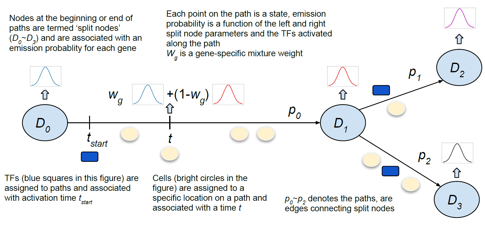

# CSHMM-TF-for-time-series-scRNA-Seq

This github repository provides the source code of Continuous-State Hidden Markov Model with Transcription Factors (CSHMM-TF) for the paper "Inferring TF activation order in time series scRNA-Seq studies". See the abstract below:
  Methods for the analysis of time series single cell expression data (scRNA-Seq) either do not utilize information about transcription factors (TFs) and their targets or only study these as a post-processing step. Here we present the Continuous-State Hidden Markov Models TF (CSHMM-TF) method which integrates probabilistic modeling of scRNA-Seq data with the ability to assign TFs to specific activation points in the learned model. TFs predicted to regulate specific paths in the model are assumed to influence the emission probabilities for cells assigned to later time points on their path allowing us to identify not just the TFs controling each path but also their order of activation.  We tested CSHMM-TF on several mouse and human datasets. As we show, the method was able to identify known and novel TFs for all processes, assigned time of activation agrees with both expression information and prior knowledge and combinatorial predictions are supported by known interactions. We also show that CSHMM-TF improves upon prior methods that do not utilize TF-gene interaction when learning developmental models.  


 

## Before you begin
CSHMM-TF can run on Windows/MacOS/Linux systems, however you might need to solve package dependencies, which is sometimes very frustrating and time consuming. Instead of solving package dependencies yourselves, you can install docker and use the provided Dockerfile to build a simulated environment on which CSHMM-TF is guaranteed to be able to run.
* Please make sure that you have **A Docker installation**. Follow the documentation here: https://docs.docker.com/engine/installation/

* Download the Docker file for building docker image: https://raw.githubusercontent.com/jessica1338/CSHMM-TF-for-time-series-scRNA-Seq/master/Dockerfile

## Install the Docker container

Build the docker image, make sure that the downloaded Dockerfile is under the current directory
```
docker build -t cshmm_tf_release .
```

Or you can download the image from here https://drive.google.com/file/d/1hrF4PWHcM2v5XJ3uourxA0Vvv13cGrfK/view?usp=sharing and use the following command to load it
```
docker load < cshmm_tf_release_latest.tar.gz
```

Run and connect to the container:
```
 docker run -it cshmm_tf_release /bin/bash
```


## Run the initialization part within the container

Now within the container, run the example script:
```
python scdiff_init.py -d treutlein2014 -tf tfDNA_predicted_100.txt.update 
```

Sometimes the scdiff initialization result will be different than the result in our paper when you run on different environment
In this case you can skip this step and  use the provided initialization file to check if the model training is working
	[init_cluster_treutlein2014_lung.txt](/init_cluster_treutlein2014_lung.txt)

## Run the CSHMM-TF training

after the model initialization, you need to run the training script "run_TF.sh" using the following commend

```
sh run_TF.sh
```

Here we only run 2 iterations to save time, we provide the .pickle file for 10th iteration so that you can run the analysis step without training the full 10 epochs
you can use the same setting to run on your dataset

## Run the CSHMM-TF analysis 

You can use the following command to generate some of the result/visualization in paper
```
python example_train_and_analysis.py
```

You can also look at the ipython notebook: https://github.com/jessica1338/CSHMM-TF-for-time-series-scRNA-Seq/blob/master/example_train_and_analysis.ipynb


## Run your data on docker container

To mount your data on a local disk to a location within the docker filesystem, use the ```-v``` option:

```
docker run -it -v [data folder on your comupter]:[data path you want on docker container] cshmm_tf_release /bin/bash
```
For example:
```
docker run -it -v ~/my_data:/my_data_dc cshmm_tf_release /bin/bash
```
Then you can access the files in ```~/my_data``` from ```/my_data_dc``` on docker container

## USAGE of scdiff_init.py
```

usage: scdiff_init.py [-h] [-tf TF_DNA_FILE] [-d DATA_FILE] [-l LARGE_DATASET]

optional arguments:
  -h, --help            show this help message and exit
  -tf TF_DNA_FILE, --tf_dna_file TF_DNA_FILE
                        specify the tf_target file
  -d DATA_FILE, --data_file DATA_FILE
                        specify the data file
  -l LARGE_DATASET, --large_dataset LARGE_DATASET
                        specify whether or not to speed up the initialization
                        for large dataset (a different algorithm (PCA+k-means)
                        will be applied)
```
## USAGE of CSHMM_TF_train_release.py

```
usage: CSHMM_TF_train_release.py [-h] [-d DATA_FILE] [-dt DATA_FILE_TESTING]
                                 [-tf TF_FILE] [-st STRUCTURE_FILE]
                                 [-seed RANDOM_SEED] [-ni N_ITERATION]
                                 [-k K_PARAM_RANGE] [-ns N_SPLIT]
                                 [-ng N_GENE] [-lamb LAMB]
                                 [-mn MODEL_NAME]
                                 [-opt {genlasso,cvxpy}]

optional arguments:
  -h, --help            show this help message and exit
  -d DATA_FILE, --data_file DATA_FILE
                        specify the data file, if not specified then a default
                        training data file will be used
  -dt DATA_FILE_TESTING, --data_file_testing DATA_FILE_TESTING
                        specify the testing data file and output best
                        interation for testing, if not specifed then the model
                        will not do testing.
  -tf TF_FILE, --TF_file TF_FILE
                        specify the tf-dna file, if not specifed then the
                        model will not take TF into consideration.
  -st STRUCTURE_FILE, --structure_file STRUCTURE_FILE
                        specify the structure file, if not specified then a
                        default structure file will be used
  -seed RANDOM_SEED, --random_seed RANDOM_SEED
                        specify the random seed, default is 0
  -ni N_ITERATION, --n_iteration N_ITERATION
                        specify the number of training iteration, default is
                        10
  -k K_PARAM_RANGE, --k_param_range K_PARAM_RANGE
                        specify the range of K parameter, default is 10
  -ns N_SPLIT, --n_split N_SPLIT
                        specify the number of splits in learning K and assign
                        cell time, default is 100
  -ng N_GENE, --n_gene N_GENE
                        specify the maximum number of genes used in training,
                        default is 1000
  -lamb LAMB, --lamb LAMB
                        specify the regularizing parameter for L1 sparsity,
                        default is 1
  -mn MODEL_NAME, --model_name MODEL_NAME
                        specify the model_name
  -opt {genlasso,cvxpy}, --opt_method {genlasso,cvxpy}
                        specify what optimization method to solve lasso
                        problem, genlasso or cvxpy, default is cvxpy

```

## Some steps on how to train/analyze on your dataset
You can use the provided scdiff_init.py to get initialized model structure, and CSHMM_TF_train_release.py to train your model (run_TF.sh is the example script of how to use it).
After you finished the training (it will take a while), you will see some .pickle are generated for each epoch. Each of these file is the model file that is a python dictionary that stores the model parameter and cell/TF assignments.  

For analyze, see https://github.com/jessica1338/CSHMM-TF-for-time-series-scRNA-Seq/blob/master/example_train_and_analysis.ipynb for the example code for generating the analyzing results and example output figures

For preparing dataset, see the following section.

## INPUTS AND PRE-PROCESSING 
(We use the same input format as SCDIFF, so most of the following description are from their github page: https://github.com/phoenixding/scdiff/blob/master/README.md)
CSHMM_TF_train_release.py takes three required input files (-d for data file, -tf for tf-target information, and -st for initialized structure). 

* __-d__  
This specifies the single cell RNA-Seq expression data.  
If the RNA-Seq data is not processed, the instruction about how to calculate expression based on RNA-Seq raw reads can be found in many other studies, e.g (https://www.ncbi.nlm.nih.gov/pmc/articles/PMC4728800/).
For example, users can use Tophat + Cufflink to calculate the gene expression in terms of FPKM.  Please refer to corresponding tools for instructions. 
Once we get the RNA-Seq gene expression, the expression data should be transformed to log space for example by log2(x+1) where x could represent the gene expression in terms of RPKM, FPKM or TPM depending
on what tools are used to precoess the RNA-Seq expression data.  
The input file has the following formatting requirements:
	* __Header Row__  
	First 3 columns are "Cells","Time","Label" and the remaining columns are gene names.   
	* __Data Rows__  
		* __1st column__: Cell ID, represents the ID for the cell.
		* __2nd column__: Cell time, Integer, represents the measurement time of the cell. 
		* __3rd column__: Cell label, represents the label of the cell (e.g cell type if known). In most cases, we don't have any prior knowledge of the cell type. In this case, use "NA" instead.
		Or, you can use any name you want to label each cell. We don't use this information in our model and it's only used to mark the cells with 
		the same attributes (any known attributes users are interested in, for example, cell type, time point, WT/Treatment, etc.) in the visualization. 
		Please avoid too many different labels, which will make the visualization very crowded. It's recommended to use <20 different labels. 
		If, however, users want to use more labels, please use the 'NA' as the label for all cells and use the cell IDs to infer the label composition of each node. 
		* __4th- columns__: Gene expression values.  
	
	Example input:     
	[example data file (lung dataset)](/treutlein2014)

* __-tf__  
This specifies the TF-gene interaction data.  In other words, it specifies the TF targets. 
Under the tf_dna directory, we provided a [human TF-gene interaction file](Human_TF_targets.txt) and a [mouse TF-gene interaction file](Mouse_TF_targets.txt) inferred using the strategy in our previous study (https://www.ncbi.nlm.nih.gov/pubmed/20219943). 
Although this TF-gene interactions are collected in human and mouse, they should be also able to apply to other close species.
Besides, in our previous work DREM (http://sb.cs.cmu.edu/drem/), we did collected the TF-gene interactions for common species including human, mouse, fry, E.coli, yeast, Arabidopsis. 
Please refer to  http://sb.cs.cmu.edu/drem/DREMmanual.pdf appendix B for complete details. 
Those TF-gene interaction files can be downloaded from our DREM software (https://github.com/phoenixding/idrem/tree/master/TFInput).
You might need to unzip and re-format the file to satisfy the requirements. The TF-gene interaction file has the following formatting requirements:  
 
	* __Header Row__  
	```
	TF	Gene	Input
	```
	* __Data Rows__  
		* __1st column__: TF ID (gene symbol)
		* __2rd column__: gene ID (gene symbol)
		* __3rd column__: Input, optional, the interaction strength between TF and target gene. If missing, by default it is 1.  
		This column is not used in scdiff. 
		 	
	Example file:   
	[example TF gene interaction file (we also use this file in our work)](/tfDNA_predicted_100.txt.update)

* __-st__  
This is the file for initialized structure. You can generate one with your data at the step: https://github.com/jessica1338/CSHMM-TF-for-time-series-scRNA-Seq#run-the-initialization-part-within-the-container .      
If you want to use other initial structure, please make sure that file has the following format:
	* __First line__: 	
	Pairs of path IDs (p1,p2) separated by \t character, (p1,p2) means that these two paths are connected. Note that path 0 is the root node (left most, earliest node).
	* __Second Line__: 
	Pairs of (cn,p) seperated by \t, Each of these pair means that the Cell ID cn is assigned to path p. Note that the Cell ID must be the same as is in your data file.
	
	Example file:   
	[example file for initiali structure](/init_cluster_treutlein2014_lung.txt)


